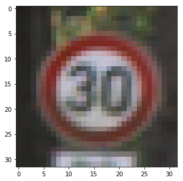

**Build a Traffic Sign Recognition Project**
The goals / steps of this project are the following:
* Load the data set
* Explore, summarize and visualize the data set.
* I counted number of each traffic sign and display.
* Data set preprocessing,include Grayscale transformation,normalization and adding fake data. 
* Design, train and test a model architecture
* By tuning some parameters to reach the target accuracy.
* Saving the model parameters;
* Use the model to make predictions on new images
* Analyze the softmax probabilities of the new images
* Summarize the results with a written report

## Load the data set
### Data Set Summary & Exploration

#### 1. Provide a basic summary of the data set. In the code, the analysis should be done using python, numpy and/or pandas methods rather than hardcoding results manually.

1. I used "len()" in the python library to calculate the size of all the traffic signs data set.
2. I used "shape()" in the numpy library to get just the shape of one traffic sign image.
3. I used "set" in the python library to change the y_train data to set type from array type.Because the keys in the set can't be the same.The I used "len()" to get the size of keys.The size is the number of all traffic signs classes

I get the follow the information by adopting the methods mentioned above：

* The size of training set is 34799
* The size of test set is 12630
* The shape of a traffic sign image is (32, 32, 3)
* The number of unique classes/labels in the data set is 43

#### 2. Include an exploratory visualization of the dataset.

Here is an exploratory visualization of the data set.I chocied randomly one image to show.The follow the image of which label is 1.  

First I used the mask manners to get each traffic sign class set from the training set by going through all the keys in the classes set.

Second I used "len()" to get the size of each traffic sign class set;

As a last step, I used "plt.bar" to plot the number bars of all traffic signs classes.

### Design and Test a Model Architecture
#### the image preprocess
1. As a first step, I decided to convert the images to grayscale because I think the major features is the outline of traffic signs by observing the image;These is little to do with the colors.And I think converting grayscale which can reduce the size of images.I used “cv2.cvtColor” to do this.

Here is an example of a traffic sign image before and after grayscaling.

2. Second,I decided to used “pixel /255.0 - 0.5” to normalize the image data because I think this is better for training model; 

3. I decided to generate additional data because I found the original size of train data is little.And the number of the diffent classes is not the same. Some have more than others. I think this will load to under-fitting very easily.To add more data to the the data set, I used the following techniques beacause I think they won't change the major features of the traffic signs.And new data set is diffent from the original data.

   * I set the "Each_label_num" which indicate the numbers of all the classes are almost the same after adding fake data.The number of each class should be bigger or the same than the "Each_label_num". I set "Each_label_num" as 2500.
   * I used “np.random.randint” to get one random number which indicate the original image should rotate the random angle. I used "ndimage.rotate" to rotate the image; The random angle can't be too big to avoid changing the traffic sign features. I set the random value from -12 to 12.
   * I used “cv2.warpAffine” to translate the image including up, down, left, right. The up-down and left-right translation distances are the random value. The random distances can't be too big to avoid changing the traffic sign features. I set the random value from -2 to 2.The code is located in the [5] cell of the Ipython notebook.
   * I get the number of each class, such as class1_num_curr for class1. So I can get the number fo new fake image is " class1_fake_num = (Each_label_num  - class1_num_curr) ". The code is located in the [4] cell of the Ipython notebook.
   * If class1_fake_num is bigger than zero which indicate this class need new fake traffic sign image whose number is class1_fake_num. The new fake images will be created include the follow two part. The code is located in the [6] cell of the Ipython notebook.

      (1). class1_multiple_num = class1_fake_num // class1_num_curr.

      The above indicate each image in the class1 should creat the class1_multiple_num fake images by roatation and  translation. 

      (2) class1_another_num = class1_fake_num % class1_num_curr.

      The above indicate I will get randomly the class1_another_num of images from the class1. Then each image of randomly geting should creat just one new fake image by roatation and  translation. 

 4. As a last step, I used “np.concatenate” to combine the original set with fake set. I will get one new traning data set.
 
 The follow image is one original image and fake image which be created from the original image：
 
 
 The follow image is showing the number of all new train classes：
  

The above image has indicated that the number of each class is enough. And the numbers of diffent classes are almost the same. 

**Attention**
As matter of fact, I just only used adding the fake images technique without using grayscale and normalization. Because I found the result accuracy won't be improved by grayscale and normalization. I don't know why. At last, I just used the channel-3 of the color images as training model input. The result accuracy can be satisfied.

#### 2. model architecture

I finally used LeNet model as training model because classfied the traffic sign is simple and the size of one image is 32*32. The  LeNet model is recommended by lessons.

My final model consisted of the following layers:

| Layer         		|     Description	        					| 
|:---------------------:|:---------------------------------------------:| 
| Input         		| 32x32x3 RGB image   							| 
| Convolution 3x3     	| 5x5 stride, VALID padding, outputs 28x28x16 	|
| RELU					|												|
| Max pooling	      	| 2x2 stride,  outputs 14x14x16 				|
| Convolution 3x3	    | 5x5 stride, VALID padding, outputs 10x10x16   |
| RELU					|												|
| Max pooling	      	| 2x2 stride,  outputs 5x5x16 				    |
| Fully connected		| outputs 120  									|
| RELU					|												|
| Fully connected		| outputs 80  									|
| RELU					|												|
| Fully connected		| outputs 43  									|

#### 3. Training process
1. I used “tf.nn.softmax_cross_entropy_with_logits” to get cross_entropy as loss function.
2. I try to tune learning rate many times to improve the validation data accuracy. Finally I set learning rate as 0.0005 which value is small.
3. I set batch size as 128 which was recommended by lessons. And for my computer memory limited, I can't set too big. Now this value is OK. 
4. As the learning rate is small I try to tune epoch many times. Because I need to train many times to update the training model. At last I set epoch as 20, because too many times will cost much more time. This value can get the project goal.

#### 4.Describe the approach for getting the validation set accuracy to be at least 0.93

At last I used an already well known architecture:
* I used Lenet-5 architecture by TensorFlow. Lenet-5 architecture is a well-known convolutional neural network with high efficiency for handwritten characters。
* I choiced Lenet-5 architecture for the follow reasons：
  1. The shape of train data set is 32*32 which is the same with the input data of the Lenet-5 architecture.
  2. The poject is a classify task which is the same with Lenet-5 architecture；
  3. Lenet-5 architecture is very famous. The lessons provided Lenet structural model and detailed explanation. And I completed the practice for classifying handwritten characters by using Lenet-5 architecture in the lessons. 
  4. Lenet-5 architecture has seven fayers which has simple architecture. But Lenet-5 architecture has almost all the base  process module in deep-learning technology which include convolutional neural network,maxpooling,activation,fully connected and so on. As the size of the train data set is not too big. I think it is hard to get the over-fitting result. So it is not necessary to used dropout process.
  
  For above the reasons, I finally used Lenet-5 architecture for trainnig model.
  
* I try to tune many parameters even if I used Lenet-5 architecture. 
  1. I add fake images which the number is 2500；
  2. I used 3-channel color images as the input of the Lenet-5 architecture. And I change the input deep parameter as 3.
  3. I changed the deep parameter of the output because the number of the traffic signs class is 43.
  4. At last I train the model by tuning the other parameters include learn-rating,epoch, batch_size.
  
  After many trainning times，my final model results were:
  * training set accuracy of 0.993
  * validation set accuracy of 0.940 
  * test set accuracy of 0.9227236661756218
 
 ### Test a Model on New Images
 #### 1. Choose five German traffic signs found on the web and provide them in the report. For each image, discuss what quality or qualities might be difficult to classify.

The follow is the five traffic signs I found on the web which was 3-channel color images. But the size of each image is not 32*32. The follow images is showed after resize processing. The original images is in folder "./test". 

I think the forth image might be difficult to classify because the traffic sign in image is not only slanted but also missing part. And the third image is also difficult because the missing part of the traffic sign is not small.

#### 2. Discuss the model's predictions on these new traffic signs and compare the results to predicting on the test set. At a minimum, discuss what the predictions were, the accuracy on these new predictions, and compare the accuracy to the accuracy on the test set

By loading the model after trainning, I predicted five image used Lenet-5 architecture. The output f each image is probabilities of 43. The index of the biggest probability in all probabilities is the final prediction. I used “tf.argmax” to get the index of the  the biggest probability. The follow table is predictions of the five images. 

| Image			                                  |     Prediction	        					    | 
|:-----------------------------------------------:|:-----------------------------------------------:| 
| label:22 (Bumpy road)                           | label:22 (Bumpy road   						    | 
| label:21 (Double curve)                         | label:21 (Double curve)  					    |
| label:15 (No vehicles)                          | label:13 (Yield) 		    				    |
| label:11 (Right-of-way at the next intersection)| label:11 (Right-of-way at the next intersection)|
| label:2  (Speed limit (50km/h))	    		  | label:2  (Speed limit (50km/h))    		        |

At last, the model was able to correctly guess 4 of the 5 traffic signs, which gives an accuracy of 80%. This compares unfavorably to the accuracy on the test set of 0.9227236661756218. I think the result is worse than the test data which has the follow reasons. 
1. The number of new traffic signs is too small. It is difficult to get the same accuracy with the test data.
2. The third image maybe is too hard to classfy correctly because the missing part is too big；
3. The number of train data sets may be not enough. The training model is not accuracy enough. 

#### 3. Describe how certain the model is when predicting on each of the five new images by looking at the softmax probabilities for each prediction. Provide the top 5 softmax probabilities for each image along with the sign type of each probability.

I used “tf.nn.softmax” to get softmax probabilities from the output predictions. And I used “tf.nn.top_k” get the top five soft max probabilities. The code is located in the [25] cell of the Ipython notebook.

For the first image, the model is relatively sure that this is a Bumpy road (probability of almost 1.0), and the image does contain a Bumpy road sign. The top five soft max probabilities were

| Probability         	|     Prediction	        					| 
|:---------------------:|:---------------------------------------------:| 
| 1.00000000e+00        | label:22   									| 
| 6.53793540e-21     	| label:29 										|
| 1.47892222e-26		| label:24										|
| 5.29135071e-36	    | label:26					 			    	|
| 0.00000000e+00	    | label:0           							|

For the second image, the model is relatively sure that this is a Double curve (probability of almost 0.99), and the image does contain a Double curve sign. The top five soft max probabilities were

| Probability         	|     Prediction	        					| 
|:---------------------:|:---------------------------------------------:| 
| 9.93509352e-01        | label:21  									| 
| 6.49054348e-03     	| label:23										|
| 1.10186704e-07		| label:31										|
| 5.59641187e-08	    | label:19					 				    |
| 3.58229245e-11	    | label:29      							    |

For the third image, the model is relatively sure that this is a Yield (probability of almost 0.99), and but the image doesn't contain any Yield sign. This image predicted wrong. The image sould be no vehicles. The top five soft max probabilities were

| Probability         	|     Prediction	        					| 
|:---------------------:|:---------------------------------------------:| 
| 9.99991655e-01        | label:13   									| 
| 4.21772847e-06     	| label:2 										|
| 4.05059154e-06		| label:7										|
| 7.52240723e-08	    | label:15					 				    |
| 5.31302891e-10	    | label:9      							        |

For the forth image, the model is relatively sure that this is a Right-of-way at the next intersection (probability of almost 1.0), and the image does contain a Right-of-way at the next intersection sign. The top five soft max probabilities were

| Probability         	|     Prediction	        					| 
|:---------------------:|:---------------------------------------------:| 
| 1.00000000e+00        | label:11   									| 
| 2.72043257e-20     	| label:21 										|
| 1.03631239e-20		| label:30									    |
| 3.50407947e-25	    | label:25					 				    |
| 2.30620161e-30	    | label:24      							    |

For the fifth image, the model is relatively sure that this is a Speed limit (50km/h) (probability of almost 1.0), and the image does contain a Speed limit (50km/h) sign. The top five soft max probabilities were

| Probability         	|     Prediction	        					| 
|:---------------------:|:---------------------------------------------:| 
| 1.00000000e+00        | label:2   									| 
| 4.43344909e-11     	| label:40										|
| 3.50987017e-11		| label:3										|
| 2.65172988e-11	    | label:31					 				    |
| 3.86616130e-12	    | label:5      							        |
